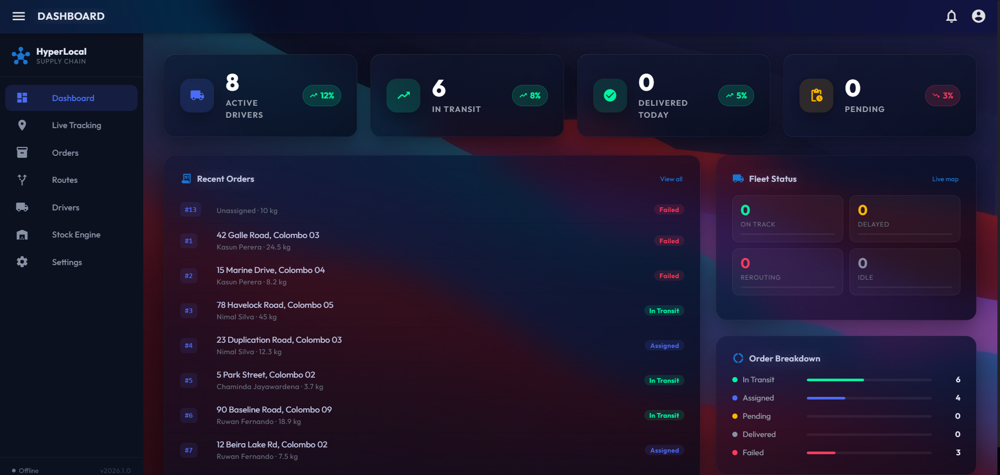

<div align="center">

# 🌐 Hyper-Local Supply Chain Optimizer (2026 Edition) 🚀


<br />

> **A next-generation, AI-first SaaS platform designed to optimize hyper-local supply chains with real-time tracking, live analytics, and an ultra-premium glassmorphism UI.**

<br />



<br />

</div>

## ✨ Key Features

- **🚀 Real-Time Fleet Tracking**: Monitor delivery drivers live on the map utilizing WebSockets and Mapbox integrations.
- **🎨 Next-Level Premium UI/UX**: Immersive 3D animated video backgrounds, frosted glass panels (Glassmorphism), and ultra-smooth Vue Router transitions. 
- **⚡ AI Route Optimization**: Dynamic algorithm simulations predicting delays and calculating the fastest routes.
- **📈 Live Dashboard KPIs**: Real-time sales, order, and stock tracking using neon indicators.
- **🛡️ FastAPI Backend Core**: Lightning-fast endpoints combined with SQLAlchemy ORM handling live streams.

## 🛠️ Tech Stack

### Frontend
- **Vue 3** (Composition API)
- **Quasar Framework** (Vite-powered)
- **Pinia** (State Management)
- **Mapbox GL JS** (Live Route Mapping)
- **Custom CSS Animations** (Keyframe-driven Video Backgrounds)

### Backend
- **Python 3.x**
- **FastAPI** (Asynchronous backend)
- **SQLAlchemy** (Database ORM)
- **Uvicorn** (ASGI server)
- **WebSockets** (Real-time duplex communication)

## 📌 Project Architecture

- `/src` - Quasar Frontend Vue Application
  - `/pages` - Core views (Dashboard, Drivers, Orders, Map Tracking, Settings)
  - `/layouts` - Glassmorphism UI Wrappers and Navigation Drawers
  - `/css` - Custom styling and 3D background logic
- `/backend` - FastAPI Application
  - `/routers` - REST API and WS Endpoint Handlers
  - `main.py` - Core server bootstrap
  - `simulate_driver.py` - AI background process injecting map data to WS nodes

## 🚀 Quick Start / Development Setup

### 1. Clone & Set Up the Backend
```bash
cd backend
python -m venv venv
venv\Scripts\activate  # Windows
pip install -r requirements.txt
python seed.py         # Initialize the SQLite database with seed data
python main.py         # Start the FastAPI Server on port 8000
```

### 2. Set Up the Quasar Frontend
```bash
# Return to the root directory
npm install
npx quasar dev -p 9001
```
Now, simply open `http://localhost:9001` in your browser to experience the future.

## 🏆 Crafted By
**G.Nawod Sanjana** - Pushing the boundaries of modern, immersive application design.
